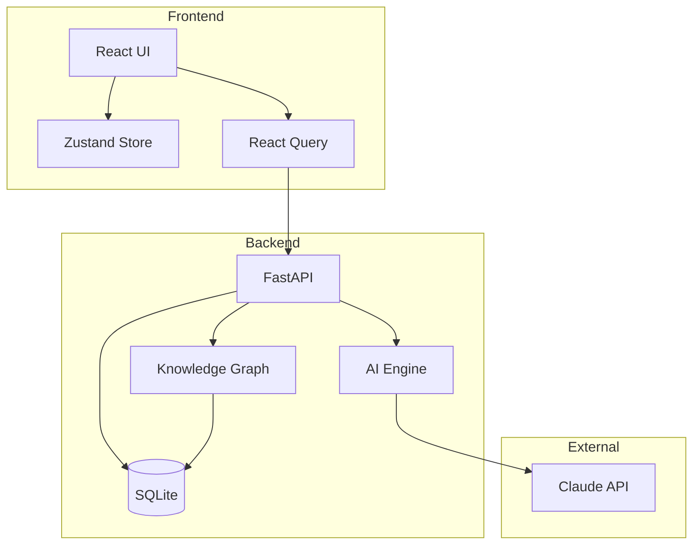

# Lorekeeper

```
██╗      ██████╗ ██████╗ ███████╗██╗  ██╗███████╗███████╗██████╗ ███████╗██████╗
██║     ██╔═══██╗██╔══██╗██╔════╝██║ ██╔╝██╔════╝██╔════╝██╔══██╗██╔════╝██╔══██╗
██║     ██║   ██║██████╔╝█████╗  █████╔╝ █████╗  █████╗  ██████╔╝█████╗  ██████╔╝
██║     ██║   ██║██╔══██╗██╔══╝  ██╔═██╗ ██╔══╝  ██╔══╝  ██╔═══╝ ██╔══╝  ██╔══██╗
███████╗╚██████╔╝██║  ██║███████╗██║  ██╗███████╗███████╗██║     ███████╗██║  ██║
╚══════╝ ╚═════╝ ╚═╝  ╚═╝╚══════╝╚═╝  ╚═╝╚══════╝╚══════╝╚═╝     ╚══════╝╚═╝  ╚═╝
```

**AI-Powered Dungeon Master for Tabletop RPGs**

Lorekeeper is a full-stack application that brings your tabletop RPG campaigns to life with AI-generated storylines, dynamic NPC dialogue, procedural encounters, and a knowledge graph that ensures perfect narrative consistency across sessions.

---

## Features

- **Dynamic Storytelling** - AI-generated narrative that responds to player actions with meaningful consequences
- **Knowledge Graph** - Every entity, relationship, and event is tracked, ensuring the world "remembers" everything
- **Living NPCs** - Characters with persistent personalities, memories, and evolving relationships
- **Smart Encounters** - Balanced combat, social, and puzzle encounters tailored to your party
- **Procedural Maps** - AI-generated locations with rich descriptions and interconnected world building
- **Dice System** - Full RPG dice mechanics with advantage, disadvantage, and skill checks
- **Session Recaps** - AI-generated "Previously on..." summaries to keep everyone aligned

---

## Architecture



---

## Tech Stack

| Layer | Technology |
|-------|------------|
| **Frontend** | React 18, TypeScript, Vite, Tailwind CSS |
| **State** | Zustand, TanStack Query |
| **Backend** | Python 3.11+, FastAPI, Pydantic v2 |
| **Database** | SQLite with SQLAlchemy (async) |
| **AI** | Anthropic Claude (claude-sonnet-4-20250514) |
| **Knowledge Graph** | NetworkX |
| **UI** | Framer Motion, Lucide Icons, React Markdown |

---

## Quick Start

### Prerequisites

- Python 3.11+
- Node.js 18+
- Anthropic API key

### Installation

```bash
# Clone the repository
git clone https://github.com/yourusername/lorekeeper.git
cd lorekeeper

# Backend setup
cd backend
python -m venv venv
source venv/bin/activate  # On Windows: venv\Scripts\activate
pip install -r requirements.txt
cp .env.example .env
# Edit .env and add your ANTHROPIC_API_KEY

# Start backend
python run.py

# Frontend setup (new terminal)
cd frontend
npm install
npm run dev
```

The application will be available at:
- Frontend: http://localhost:5173
- Backend API: http://localhost:8000
- API Docs: http://localhost:8000/docs

---

## Project Structure

```
lorekeeper/
├── backend/
│   ├── app/
│   │   ├── main.py              # FastAPI application
│   │   ├── config.py            # Configuration management
│   │   ├── database.py          # SQLAlchemy setup
│   │   ├── models/              # Database models
│   │   ├── schemas/             # Pydantic schemas
│   │   ├── routers/             # API endpoints
│   │   ├── services/            # Business logic
│   │   │   ├── ai_engine.py     # Anthropic integration
│   │   │   ├── narrative_engine.py
│   │   │   ├── npc_engine.py
│   │   │   ├── encounter_engine.py
│   │   │   ├── map_generator.py
│   │   │   ├── knowledge_graph.py
│   │   │   └── world_state.py
│   │   └── utils/
│   │       ├── dice.py          # Dice mechanics
│   │       └── prompts.py       # AI prompt templates
│   ├── requirements.txt
│   └── run.py
├── frontend/
│   ├── src/
│   │   ├── api/                 # API hooks
│   │   ├── components/          # React components
│   │   ├── pages/               # Page components
│   │   ├── stores/              # Zustand stores
│   │   ├── types/               # TypeScript types
│   │   └── utils/               # Utilities
│   ├── package.json
│   └── vite.config.ts
└── README.md
```

---

## API Endpoints

### Campaigns
| Method | Endpoint | Description |
|--------|----------|-------------|
| POST | `/api/campaigns` | Create new campaign |
| GET | `/api/campaigns` | List all campaigns |
| GET | `/api/campaigns/{id}` | Get campaign details |
| PUT | `/api/campaigns/{id}` | Update campaign |
| DELETE | `/api/campaigns/{id}` | Delete campaign |

### Sessions
| Method | Endpoint | Description |
|--------|----------|-------------|
| POST | `/api/campaigns/{id}/sessions` | Start new session |
| GET | `/api/campaigns/{id}/sessions` | List sessions |
| GET | `/api/sessions/{id}` | Get session details |
| POST | `/api/sessions/{id}/end` | End session |

### Narrative
| Method | Endpoint | Description |
|--------|----------|-------------|
| POST | `/api/sessions/{id}/action` | Submit player action |
| POST | `/api/sessions/{id}/choice/{idx}` | Select branching choice |
| GET | `/api/sessions/{id}/story` | Get story feed |
| POST | `/api/sessions/{id}/recap` | Generate recap |

### Characters
| Method | Endpoint | Description |
|--------|----------|-------------|
| POST | `/api/campaigns/{id}/characters` | Create character |
| GET | `/api/campaigns/{id}/characters` | List characters |
| POST | `/api/characters/{id}/dialogue` | Chat with NPC |

### Encounters
| Method | Endpoint | Description |
|--------|----------|-------------|
| POST | `/api/sessions/{id}/encounters` | Generate encounter |
| POST | `/api/encounters/{id}/action` | Submit action |
| POST | `/api/encounters/{id}/resolve` | End encounter |

### Knowledge Graph
| Method | Endpoint | Description |
|--------|----------|-------------|
| GET | `/api/campaigns/{id}/knowledge` | Get full graph |
| GET | `/api/campaigns/{id}/knowledge/search` | Search entities |
| GET | `/api/campaigns/{id}/knowledge/timeline` | Get timeline |

### Dice
| Method | Endpoint | Description |
|--------|----------|-------------|
| POST | `/api/dice/roll` | Roll dice |
| POST | `/api/dice/skill-check` | Make skill check |
| POST | `/api/dice/attack` | Make attack roll |

---

## Knowledge Graph

The knowledge graph is Lorekeeper's core innovation. Every entity in the game world is tracked as a node with relationships forming edges.

### Node Types
- **CHARACTER** - PCs, NPCs, monsters, deities
- **LOCATION** - Cities, dungeons, rooms, planes
- **EVENT** - Story beats, battles, discoveries
- **ITEM** - Weapons, artifacts, quest items
- **FACTION** - Guilds, kingdoms, organizations
- **QUEST** - Active, completed, failed quests
- **LORE** - World history, legends, secrets

### Edge Types
- `LOCATED_IN` - Character at Location
- `OWNS` - Character has Item
- `KNOWS` - Character knows Character
- `MEMBER_OF` - Character in Faction
- `PARTICIPATED_IN` - Character in Event
- `OCCURRED_AT` - Event at Location
- And more...

### How It Works

Before every AI generation:
1. Relevant entities are identified (current location, nearby NPCs, etc.)
2. The graph is traversed to collect context
3. A natural language summary is generated
4. This context is injected into the AI prompt

After every AI response:
1. New entities mentioned are added to the graph
2. Relationships are updated
3. Events are recorded with timestamps

This ensures the AI never contradicts established facts.

---

## Environment Variables

```env
# Required
ANTHROPIC_API_KEY=your-api-key-here

# Optional (with defaults)
DATABASE_URL=sqlite+aiosqlite:///./lorekeeper.db
HOST=0.0.0.0
PORT=8000
DEBUG=true
```

---

## Screenshots

### Campaign Dashboard
*Campaign overview with quick actions and session history*

### Game Session
*Main gameplay interface with narrative feed and player input*

### Character Management
*Party roster and NPC tracking*

### World Map
*Interactive map visualization*

### Knowledge Graph
*Force-directed graph of world entities*

---

## Development

### Running Tests

```bash
# Backend tests
cd backend
pytest

# Frontend tests
cd frontend
npm test
```

### Database Migrations

```bash
cd backend
alembic revision --autogenerate -m "Description"
alembic upgrade head
```

---

## Contributing

1. Fork the repository
2. Create a feature branch (`git checkout -b feature/amazing-feature`)
3. Commit your changes (`git commit -m 'Add amazing feature'`)
4. Push to the branch (`git push origin feature/amazing-feature`)
5. Open a Pull Request

---

## License

This project is licensed under the MIT License - see the [LICENSE](LICENSE) file for details.

---

## Acknowledgments

- [Anthropic](https://anthropic.com) for the Claude API
- The tabletop RPG community for inspiration
- All contributors and testers

---

*Built with passion for storytelling and adventure.*
